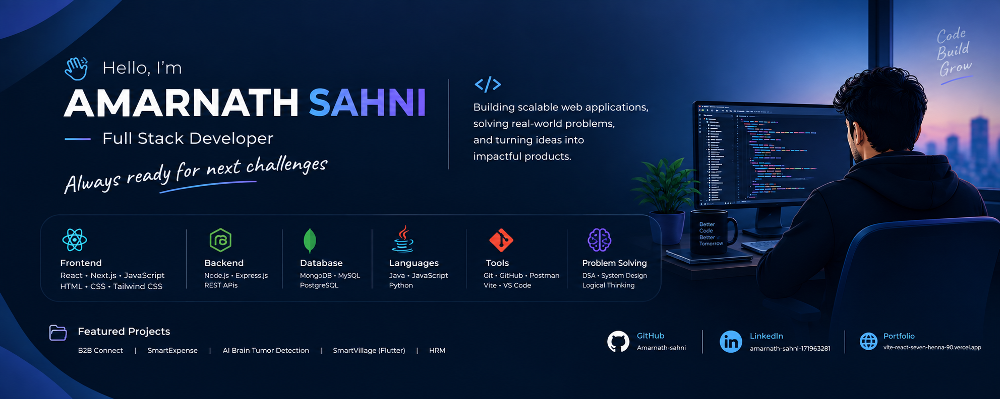

<p align="center">
  
</p>

<h1 align="center">Hi 👋, I'm Amarnath Sahni</h1>

<h3 align="center">
Full Stack Developer • Software Developer • Problem Solver
</h3>

<p align="center">
  <i>Always ready for the next challenge.</i>
</p>

<p align="center">
  <a href="https://github.com/Amarnath-sahni">
    
  </a>
  <a href="https://www.linkedin.com/in/amarnath-sahni-171963281/">
    
  </a>
</p>

---

## 👨‍💻 About Me

I'm a **Full Stack Developer** with hands-on experience building modern web applications using the **MERN stack**.

I enjoy transforming ideas into practical software, solving programming problems, designing APIs, working with databases, and continuously improving my development skills.

* 💻 Full Stack Developer focused on **React.js, Node.js, Express.js & MongoDB**
* 🚀 Experienced in building **REST APIs and full-stack applications**
* 🔐 Experience with **JWT authentication and protected routes**
* 🧩 Passionate about **DSA and problem solving**
* 🏗️ Interested in building scalable and real-world software
* 🤖 Exploring **AI-integrated applications**
* 📚 Continuously learning new technologies
* 🔥 **Always ready for the next challenge**

---

## 🧑‍💼 Professional Experience

### 💼 Full Stack Developer Intern — Speqto Technologies

**Dec 2025 – Feb 2026**

* Developed and maintained responsive frontend applications using **React.js**
* Integrated and consumed **REST APIs**
* Implemented **JWT authentication and protected routes**
* Worked with reusable React components
* Improved application performance using techniques such as **React.memo and lazy loading**
* Worked with **Context API** for application state management
* Collaborated on backend integration and database-related functionality

### 💼 MERN Stack Intern — QSpiders

**Jul 2025 – Dec 2025**

* Received hands-on industrial training in **MERN stack development**
* Built frontend interfaces using React.js
* Worked with Node.js and Express.js
* Developed REST API integrations
* Worked with MongoDB and application data management
* Practiced Git, GitHub, debugging and development workflows

### 💼 Backend Development — IIT Kanpur Techkriti

**Professional Certification / Training**

* Completed professional backend development training
* Worked with backend development concepts and API-based application architecture
* Strengthened understanding of server-side development

### 💼 Backend Development Summer Training — Vital Skill

**Jun 2024 – Aug 2024**

* Learned backend development fundamentals
* Worked with APIs, server-side concepts and database integration
* Practiced building backend-oriented applications

---

## 🚀 Featured Projects

### 🏢 B2B Connect

A B2B textile marketplace designed to connect **retailers, businesses, manufacturers, factories and wholesale suppliers**.

#### Key Features

* 🛍️ Wholesale product discovery
* 🏭 Factory and supplier discovery
* 📦 Product details and stock management
* 🛒 Shopping cart
* 🔐 Authentication and protected routes
* 📍 Address and delivery management
* 📋 Checkout workflow
* 🚚 Shipment tracking
* 👤 User dashboard
* 📱 Responsive UI

**Tech Stack:** React.js • Vite • Tailwind CSS • React Router • Context API • JavaScript

---

### 💰 SmartExpense

A full-stack expense management application designed to help users manage their income, expenses and financial goals.

#### Key Features

* 💵 Income and expense management
* 🎯 Financial targets
* 📊 Expense visualization
* 🤖 AI-powered financial suggestions
* 📈 Financial insights
* 🔐 JWT authentication
* 🔒 Protected routes
* 📄 PDF/DOC export functionality
* 📱 Responsive interface

**Tech Stack:** React.js • Node.js • Express.js • MongoDB • Gemini API • Chart.js • Redux Toolkit • JWT

---

### 🧠 AI Brain Tumor Detection System

An AI-integrated full-stack application that uses a machine-learning model to classify brain MRI images into different categories.

#### Features

* 🖼️ MRI image upload
* 🤖 TensorFlow-based prediction
* 🧠 Image classification
* ⚡ Flask ML API
* 🌐 MERN-based application interface
* 🔗 Frontend-to-ML API integration

**Technology:** React.js • Node.js • Express.js • MongoDB • Flask • Python • TensorFlow

---

### 🌱 SmartVillage

A mobile application concept designed to provide useful digital services and information for village communities.

**Technology:** Flutter • Dart

---

### 📊 Data Visualization Dashboard

An interactive dashboard project focused on presenting structured information through charts and visual components.

**Technology:** React.js • JavaScript • Charting Libraries

---

## 🛠️ Technical Skills

### 💻 Programming Languages
<p>
  
  
  
</p>

### 🎨 Frontend
<p>
  
  
  
  
  
  
</p>

### ⚙️ Backend
<p>
  
  
  
  
</p>

### 🗄️ Databases

<p>
  
  
  
</p>

### 🔧 Tools & Technologies

<p>
  
  
  
  
  
  
</p>

---

## 🧠 Problem Solving & DSA

I actively practice **Data Structures and Algorithms using Java**.

* 🔹 300+ LeetCode problems solved
* 🔹 Arrays
* 🔹 Strings
* 🔹 Hashing
* 🔹 Recursion
* 🔹 Linked Lists
* 🔹 Stacks & Queues
* 🔹 Trees
* 🔹 Searching & Sorting
* 🔹 Dynamic Programming
* 🔹 Problem-solving patterns

---

## 🏆 Achievements

* 🥇 **1st Place — College Hackathon**
* 🥈 **2nd Place — TechFest Debugging Competition**
* 🏅 Achieved **10.0 CGPA in 7th Semester**
* 💻 Solved **300+ problems on LeetCode**

---

## 🎓 Education

### 🎓 Bachelor of Technology — Computer Science & Engineering

**I.K. Gujral Punjab Technical University**

**CGPA:** 8.189

**Graduation:** 2026

### Academic Background

* **Class XII:** 71% — BSEB
* **Class X:** 79% — BSEB

---

## 📜 Certifications & Training

* 🎓 **IIT Kanpur Techkriti — Backend Development**
* 💻 **QSpiders — MERN Stack Development / Industrial Training**
* ⚙️ **Vital Skill — Backend Development Summer Training**

---

## 🔥 What I Like Building

```text
Web Applications
       ↓
REST APIs
       ↓
Authentication & Authorization
       ↓
Database Systems
       ↓
Scalable Backend Architecture
       ↓
Modern React Interfaces
       ↓
Real-World Products
```

I particularly enjoy working on projects where **frontend, backend, database and real-world business requirements come together**.

---

## 📈 GitHub Statistics

<p align="center">
  
  
</p>

---

## 🔥 GitHub Streak

<p align="center">
  
</p>

---

## 📊 Contribution Activity

<p align="center">
  
</p>

---

## 🚀 Current Focus

```text
Full Stack Development
        +
DSA & Problem Solving
        +
Backend Development
        +
System Design
        +
AI Integration
        +
Building Real-World Products
```

Currently, I am focused on improving my **software engineering fundamentals**, building practical full-stack applications, and taking on new technical challenges.

---

## 🌱 Currently Learning

* Advanced React.js
* Next.js
* Backend Architecture
* System Design
* Advanced JavaScript
* Database Optimization
* API Design
* Docker & Cloud Technologies
* AI Integration in Full-Stack Applications

---

## 💡 Developer Philosophy

> **Build. Solve. Learn. Repeat.**

I believe every difficult problem is an opportunity to learn something new.

**Always ready for the next challenge. 🚀**

---

## 🌐 Let's Connect

<p align="center">
  <a href="https://github.com/Amarnath-sahni">
    
  </a>
  <a href="https://www.linkedin.com/in/amarnath-sahni-171963281/">
    
  </a>
  <a href="https://vite-react-seven-henna-90.vercel.app/">
    
  </a>
</p>

---

<p align="center">
  <b>Thanks for visiting my profile! ⭐</b>
</p>

<p align="center">
  <i>Always building. Always learning. Always ready for the next challenge.</i>
</p>
